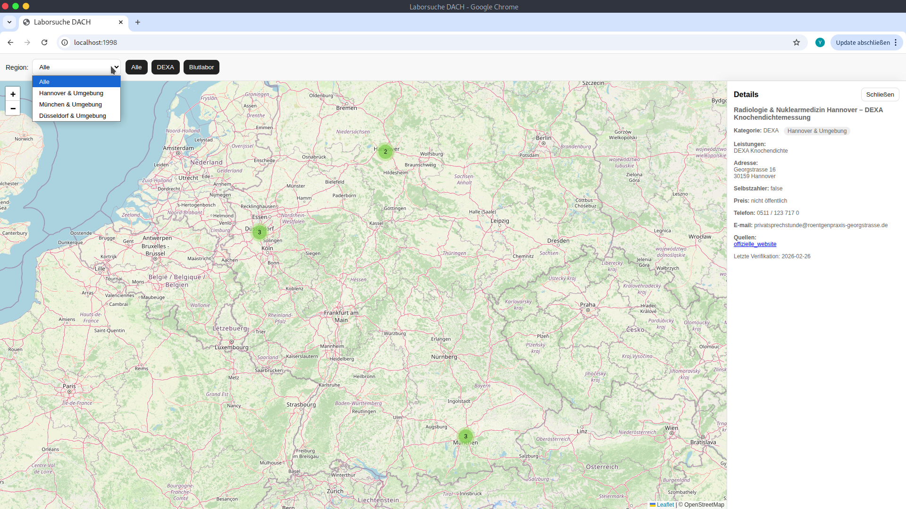
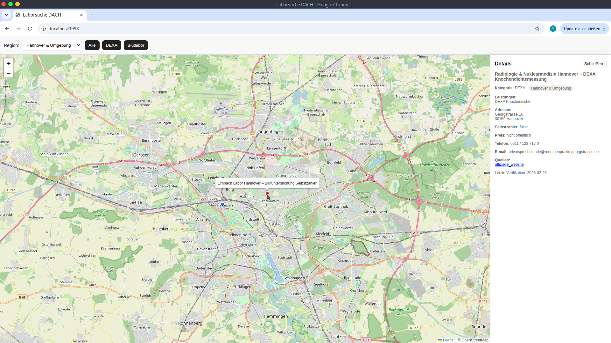

# Laborsuche DACH
*Interaktive Karte für DEXA Body Composition & Selbstzahler‑Blutlabore*

<p align="center">
  
  
  
  
  
</p>


## Unterstützte Regionen (MVP)

- Hannover & Umgebung  
- München & Umgebung  
- Düsseldorf & Umgebung  


## Inhaltsverzeichnis

- [Projektziel](#projektziel)
- [Scope des MVP](#scope-des-mvp)
- [Problemstellung](#problemstellung)
- [Vorgehensweise](#vorgehensweise)
- [Datenquellen und Validierung](#datenquellen-und-validierung)
- [Datenmodell](#datenmodell)
- [Designentscheidungen](#designentscheidungen)
- [Projektstruktur](#projektstruktur)
- [Kartenfunktion](#kartenfunktion)
- [Screenshots](#screenshots)
- [Diagramme](#diagramme)
- [Projekt lokal starten](#projekt-lokal-starten)
- [Automatisierte Datenpipeline](#automatisierte-datenpipeline)
- [Weiterführende-Links](#weiterführende-links)


## Projektziel

Dieses MVP bietet eine **strukturierte, filterbare und verifizierte Übersicht** spezialisierter medizinischer Dienstleistungen:

- **DEXA Body Composition** (Ganzkörperanalyse, nicht nur Knochendichte)  
- **Selbstzahler‑Bluttests ohne Überweisung**


## Scope des MVP

### ✔️ Enthalten

- Manuell validierte Anbieter in drei Regionen  
- Klare Kategorisierung (DEXA / BLOOD_LAB)  
- Interaktive Karte mit Filtern  
- Preisangaben inkl. Quellen (falls verfügbar)  
- Verifikationsdatum pro Eintrag  
- Erweiterbares JSON‑Datenmodell  

### ❌ Nicht enthalten

- Vollständige DACH‑Abdeckung  
- Automatisiertes Scraping (nur Template)  
- Backend / API  
- Benutzerverwaltung  


## ⚠️ Problemstellung

Es existiert keine zentrale, verlässliche Übersicht für:

1. DEXA‑Standorte, die **Body Composition** anbieten  
2. Blutlabore, die **Selbstzahler‑Tests ohne Überweisung** ermöglichen  

Häufige Verwechslung:

| Begriff | Bedeutung |
|--|--|
| **DXA Knochendichte** | Osteodensitometrie |
| **DXA Body Composition** | Fett‑, Muskel‑ & Ganzkörperanalyse |


## Vorgehensweise

### 1. Definitionskriterien

Ein Anbieter wird nur aufgenommen, wenn:

- **Body Composition** explizit erwähnt wird  
  oder  
- **Selbstzahler‑Bluttests ohne Überweisung** eindeutig beschrieben sind

Unklare oder indirekte Hinweise führen zum Ausschluss.


### 2. Manuelle Verifikation

Jeder Eintrag wird:

- auf der offiziellen Website geprüft  
- eindeutig kategorisiert  
- mit `last_verified` versehen  
- mit Quelle dokumentiert


## Datenquellen und Validierung

Daten stammen ausschließlich von:

- offiziellen Praxis‑Websites  
- offiziellen Labor‑Websites  

Keine Drittanbieter‑Portale oder aggregierten Plattformen.


## Datenmodell

Datei: `providers.json`

### Eigenschaften pro Anbieter

- `id`  
- `region_id`  
- `name`  
- `category` (DEXA / BLOOD_LAB)  
- `services` (Objekt)  
- `self_pay` (bool)  
- `address` (street, zip, city, country)  
- `location` (lat, lng)  
- `contact` (phone, website, email)  
- `prices_public` (bool / details)  
- `last_verified` (YYYY-MM-DD)  

### Beispiel

```json
{
  "id": "de-haj-dexa-001",
  "region_id": "haj",
  "name": "Beispiel Praxis Hannover",
  "category": "DEXA",
  "services": {
    "dexa_body_composition": true,
    "dexa_bone_density": true,
    "blood_self_pay": false
  },
  "self_pay": true,
  "address": {
    "street": "Musterstraße 1",
    "zip": "30159",
    "city": "Hannover",
    "country": "DE"
  },
  "location": {
    "lat": 52.379189,
    "lng": 9.759
  },
  "contact": {
    "phone": "+49 511 000000",
    "website": "https://example.de"
  },
  "prices_public": false,
  "last_verified": "2026-02-28"
}

```

## Designentscheidungen

- `services` als Objekt → klar filterbar   
- `last_verified` → Transparenz  
- Struktur API-ready und erweiterbar  

## Projektstruktur

    laborsuche-dach/
    │
    ├── README.md
    │   
    ├── scripts/
    │   ├── README.md
    │   ├── geocode.py
    │   ├── validate.py
    │   ├── scrape_template.py
    │   ├── providers.geocoded.json
    │   │  
    │   ├── fixtures/
    │   │   ├── sample_radiologie.html
    │   │   └── sample.html
    │   │
    │   ├── sources/
    │   │   ├── radiologie.py
    │   │   ├── README.md
    │   │   └── ...
    │   │
    │   └── requirements.txt
    │
    ├── assets/
    │   └──screenshots/
    │       ├── map-view.png
    │       └── detail-view.png
    │   
    │
    └── docker/
        ├── Dockerfile
        ├── docker-compose.yml
        └── web/
            ├── index.html
            └── providers.json


## Kartenfunktion

### Technologie

- Leaflet  
- OpenStreetMap  
- Statische JSON-Datenstruktur (`providers.json`)

### Features

- Regionenzentrierte Karte  
- Farblich differenzierte Marker  
  - Blau = DEXA  
  - Rot = Blutlabor  
- Filter: Alle / DEXA / Blutlabor  
- Sidebar mit Detailansicht (Kontakt, Services, Preise, Quelle, last_verified)
- Responsive Design 


## Screenshots

### **Kartenansicht**

### **Detailansicht**


## Diagramme

### **Datenpipeline**
- flowchart TD
    - A[providers.json] --> B[validate.py]
    - B --> C[geocode.py]
    - C --> D[Frontend: Leaflet]
### **Architekturübersicht**
  - graph LR
      - User --> Browser
      - Browser --> Leaflet
      - Leaflet --> JSON[providers.json]
      - JSON --> Scripts[scripts/*.py]


## Projekt lokal starten

### Voraussetzung

* Python 3

Im Projektordner ausführen:

```bash
python3 -m http.server 8000
```

Dann im Browser öffnen:

```
http://localhost:8000
```


## Automatisierte Datenpipeline

Das Projekt enthält optionale Scripts zur Skalierung:

- `scrape_template.py` → Beispielhafte Extraktion einer Quelle
- `geocode.py` → Automatische Lat/Lng Generierung via Nominatim
- `validate.py` → Prüfung der JSON-Struktur und Pflichtfelder

Beispiel:
```bash
 - python3 scripts/geocode.py --file docker/web/providers.json --out scripts/providers.geocoded.json
 - python3 scripts/validate.py docker/web/providers.json
 - python3 scripts/scrape_template.py --fixture scripts/fixtures/sample.html
```

## Weiterführende Links
- scripts/ — Data Processing Scripts (siehe ➡️ [Data Processing Scripts](scripts/README.md))
- scripts/sources/ — Modulare Scraper (siehe ➡️ [Modulare Scraper](scripts/sources/README.md))
